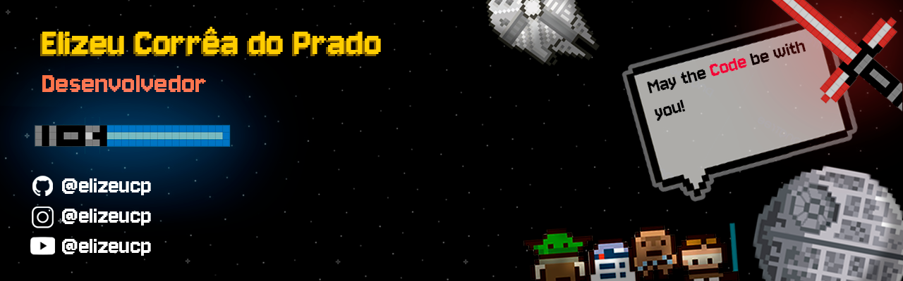

## 🖖 Saudações, Jedi! Seja bem-vindo(a) ao meu perfil!

## 

Sou de **Goiânia - GO**, tenho 18 anos e atualmente estou cursando **Análise e Desenvolvimento de Sistemas**. Sou apaixonado por tecnologia, invenções e pelo potencial criativo que a área oferece.

Tenho grande interesse por **desenvolvimento web**, **criação de aplicações**, **jogos** e por áreas que se conectam com engenharia, como **mecatrônica**, **robótica**, **elétrica** e **eletrônica**. Acredito que conhecimento técnico, criatividade e curiosidade formam a base para soluções inovadoras.

### 💻 Tecnologias que utilizo

- **Front-end**: HTML, CSS, JavaScript  
- **Back-end / Lógica**: C#, C++, Node.js
- **Ferramentas e Plataformas**: Git, GitHub, Unity (para jogos)

### 📌 Atualmente

- Estudando desenvolvimento web e boas práticas de programação  
- Criando projetos pessoais para aprofundar meus conhecimentos  
- Explorando áreas além da programação, com foco em hardware e automação

### 👤 Sobre mim

Tenho uma visão multidisciplinar sobre tecnologia. Gosto de unir **design**, **lógica**, **mecânica** e **expressão artística** em tudo que crio. Também sou fã de **cinematografia** e **música**, áreas que me inspiram constantemente a buscar novas abordagens nos meus projetos.

Já participei de diversas competições voltadas à tecnologia e inovação, como a **Olimpíada Brasileira de Robótica (OBR)**, a **First Lego League (FLL)** e o **Grand Prix de Inovação**, o que fortaleceu minha paixão por resolver problemas e trabalhar em equipe com criatividade e estratégia.

--- 

  
  

