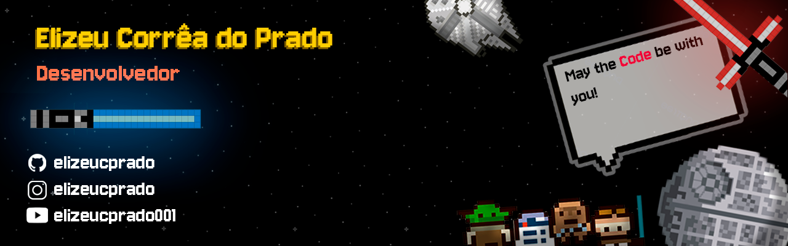

# 🖖 Greetings, Jedi! Welcome to my profile!

  

---

  

I am from **Goiânia - GO**, I'm 18 years old and I'm currently studying **Systems Analysis and Development**. I am passionate about technology, inventions and the creative potential the field offers.

I have a strong interest in **web development**, **application creation**, **games**, and in areas connected to engineering such as **mechatronics**, **robotics**, **electrical** and **electronics**. I believe that technical knowledge, creativity and curiosity form the foundation for innovative solutions.

### 💻 Technologies I use

- **Front-end**: HTML, CSS, JavaScript  
- **Back-end / Logic**: C#, C++, Node.js, Java, Python  
- **Tools and Platforms**: Git, GitHub, Unity (for games)

### 📌 Currently

- Studying web development and programming best practices  
- Building personal projects to deepen my knowledge  
- Exploring areas beyond programming, focusing on hardware and automation

### 👤 About me

I have a multidisciplinary view of technology. I like to combine **design**, **logic**, **mechanics** and **artistic expression** in everything I create. I'm also a fan of **cinematography** and **music**, which constantly inspire me to look for new approaches in my projects.

I have participated in several competitions focused on engineering, technology and innovation, such as the **Brazilian Robotics Olympiad (OBR)**, **First Lego League (FLL)**, **Grand Prix of Innovation** and **WorldSkills - Electrical Installations**, which strengthened my passion for solving problems and working in teams with creativity and strategy.

---

  
  

